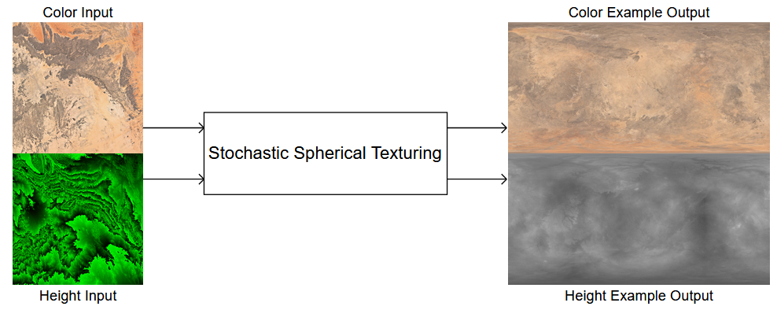
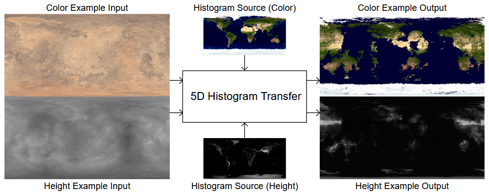
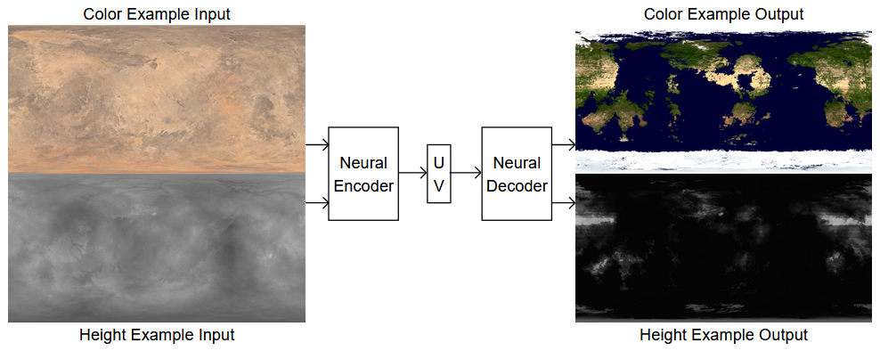
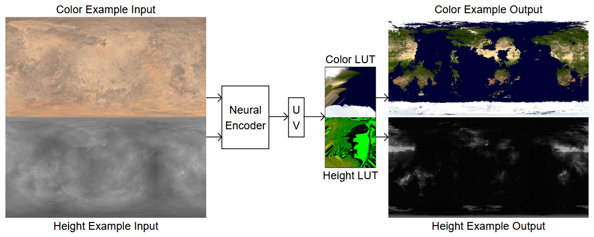

# Stochastic Planet

This project combines [Stochastic Spherical Texturing](https://github.com/danielklisch/spherical_stochastic_texturing/) with [Histogram Transfer](https://github.com/danielklisch/histogram_transfer) and Neural Networks
to create randomly generated earth-like planets.

You can try out the web demo [here](https://danielklisch.github.io/stochastic_planet/) (The page will take a while to load).

## How It Works

The shader uses 2 high resolution textures as inputs, one for color and one for height.
For each pixel Stochastic Spherical Texturing is used to generate color (RGB) and height (H) values from these textures.
To apply an earth-like stile to the result Histogram Transfer is used.
However, Histogram Transfer is performance intesive and requires knowledge of all input pixels to generate the color distributions.
For Histogram Transfer with three channels (RGB) a 3 dimensional Look Up Table (LUT) could be used.
The Histogram Transfer used here has 5 inputs: Color (RGB), Height (H), and Latitude (L).
This would result in a 5 dimensional Look Up Table which would take up too much space.
Because of this, a neural network was trained to approximate the Histogram Transfer.

In order to train the neural network a sample output was generated using Stochastic Spherical Texturing which would later serve as training data.

The full 5 dimensional Histogram Transfer using Color (RFB), Height (H) and Latitude (L) was applied to this example.

The inputs and outputs were then used as training data for the neural network.
While this resulted in a good approximation for known input data, it did not generalize well for unknown input data.
To solve this problem, an Auto Encoder was trained that first encodes the input values into two values (UV) and then decodes the output values.

The decoder was replaced with Look Up Tables for all possible values of U and V.
These Look Up Tables could then be padded to generate outputs even for unknown input values.

They can also be used to add new output values that were not part of the training data.
This was done for specularity (S) and cloud coverage (C).
Once the outputs (RGBHSC) are generated, the pixel shader uses them to render a view of the planet.
The height value (H) is used to calculate surface shading based on the sun angle.
The specularity value (S) is used to simulate the specular reflection of water and ice.